## 👨‍💻 ABOUT ME
I am a **Full Stack Developer** with a deep passion for building robust, scalable web applications and intuitive developer experiences. My focus bridges the gap between clean, premium modern frontend design and highly efficient, automated backend engineering.
When I'm not coding, I'm exploring **AI integrations**, optimizing architectures, and contributing to the open-source ecosystem.

## ⚡ TECH STACK

### Frontend

### Backend & Database

### Languages

### Tools & Infrastructure

## 📊 GITHUB STATISTICS

### 🏆 Profile Trophies

## 🚀 FEATURED PROJECTS

| Project | Description | Link |
| :--- | :--- | :--- |
| **🌐 KabarID** | Modern Indonesian News Platform with clean UI/UX | Visit |
| **⬇️ Sky Downloader** | Multi-platform, fast, and reliable media downloader | Visit |
| **🎵 Noxa** | Premium modern music player built for the web | Visit |
| **🤖 XYRA AI** | Intelligent AI-powered WhatsApp Assistant | *Private API* |
| **⚡ API Hub** | Extensive collection of custom developer APIs | *Repository* |

<i>...and 20+ other open-source projects and tools.</i>

## 🕸️ CONTRIBUTIONS
### 🐍 GitHub Snake

<picture>
<source media="(prefers-color-scheme: dark)" srcset="https://raw.githubusercontent.com/skyyy0/skyyy0/output/github-contribution-grid-snake-dark.svg">

</picture>

### 👻 Pacman Activity & 3D Metrics

<!-- To enable isometric graph, uncomment below once the metrics action runs successfully -->
<!--  -->

<i>Constantly pushing code, hunting bugs, and building the future.</i>

## 🔗 CONNECT WITH ME

